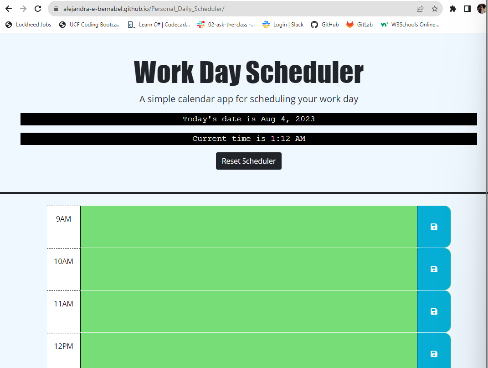

# Personal_Daily_Scheduler
A calendar application that updates in real time and allows users to view past, present, and future events.

Application saves user input to local storage to ensure that refreshing page preserves event information.

GIVEN I am using a daily planner to create a schedule
WHEN I open the planner
THEN the current day is displayed at the top of the calendar
WHEN I scroll down
THEN I am presented with timeblocks for standard business hours of 9am&ndash;5pm
WHEN I view the timeblocks for that day
THEN each timeblock is color coded to indicate whether it is in the past, present, or future
WHEN I click into a timeblock
THEN I can enter an event
WHEN I click the save button for that timeblock
THEN the text for that event is saved in local storage
WHEN I refresh the page
THEN the saved events persist

# Deployed GitHub cite address:
https://alejandra-e-bernabel.github.io/Personal_Daily_Scheduler/

# Deployed cite screenshot:
